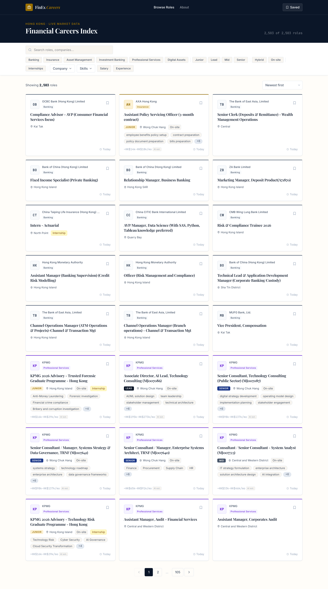
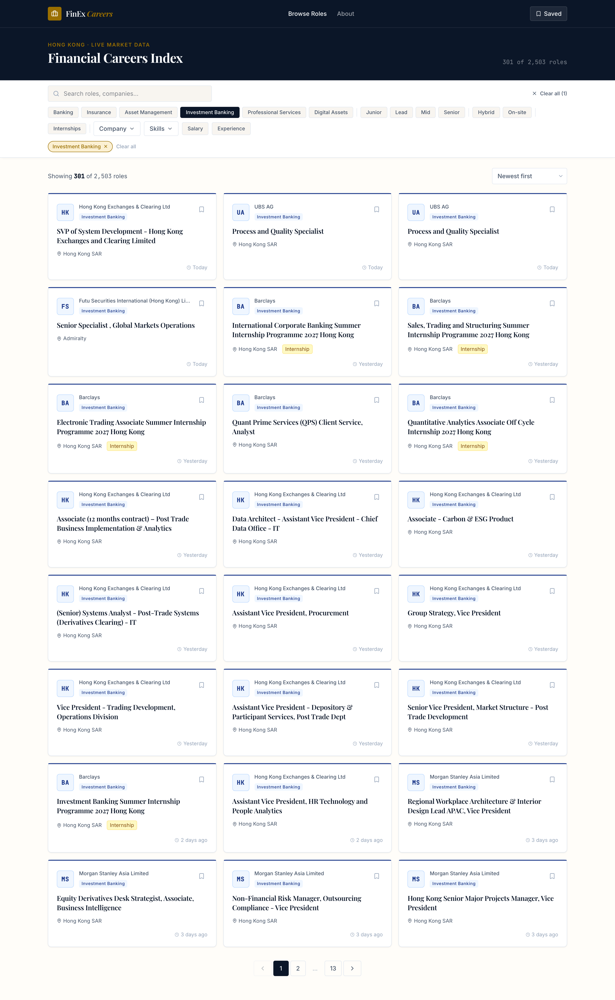
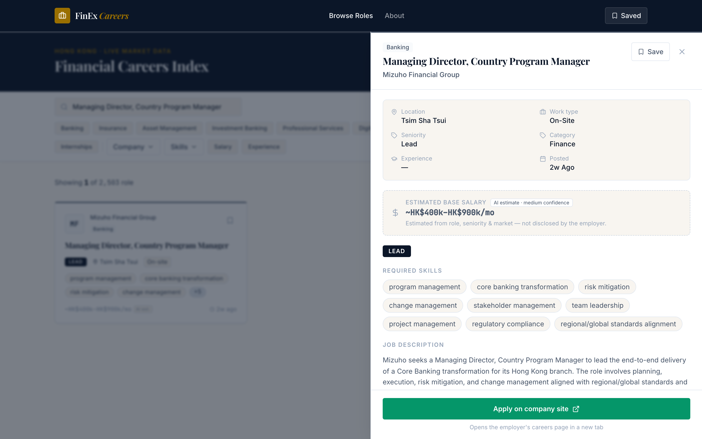
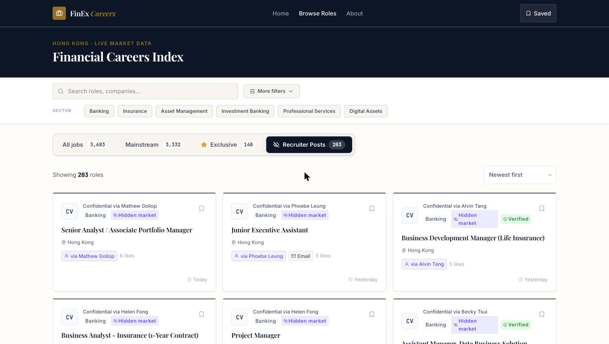
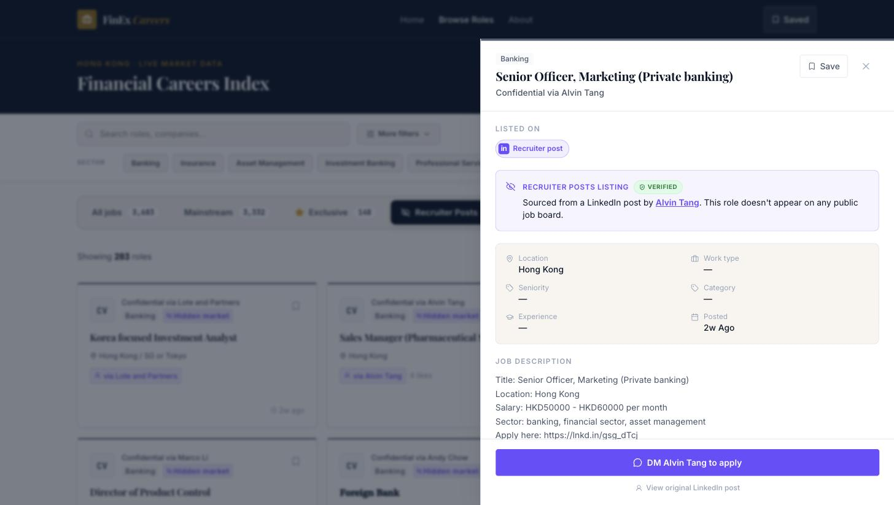
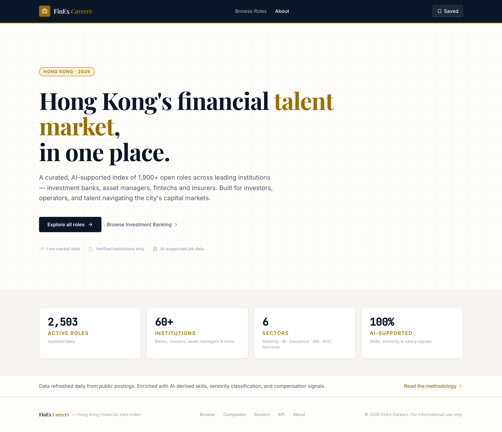

<div align="center">

# HK Financial Job-Market Intelligence Platform

**Automated collection, AI enrichment, and market intelligence for Hong Kong's financial sector**

          

*Not just a scraper — a full pipeline that **collects** jobs from 7 sources plus a LinkedIn recruiter-posts watchlist, **enriches** every listing with AI, **analyses** hiring trends over time, and **delivers** it through a web board, a boss-facing mirror, PDF intelligence reports, and daily email.*

</div>

---

## Contents

- [Overview](#overview) · [Screenshots](#screenshots) · [The Daily Pipeline](#the-daily-pipeline) · [Data Sources](#data-sources)
- [AI Enrichment](#ai-enrichment--salary-calibration) · [Market Intelligence](#market-intelligence--analytics) · [Companies Covered](#companies-covered)
- [Recruiter Posts (LinkedIn)](#recruiter-posts-linkedin) · [Architecture](#architecture) · [Tech Stack](#tech-stack) · [Database Schema](#database-schema) · [Delivery Surfaces](#delivery-surfaces)
- [Setup](#setup) · [Usage](#usage) · [Daily Automation](#daily-automation) · [Results](#results) · [Project Structure](#project-structure)

---

## Overview

A fully automated platform that tracks hiring across Hong Kong's largest banks, insurers, and asset managers. It runs end-to-end every day:

1. **Collect** — scrapes open roles from **seven sources**, each company resolved to its real Applicant Tracking System (ATS) and scraped through a **priority fallback chain**: a direct ATS JSON API where one exists → the finance-specialist board (eFinancialCareers) → general boards (JobsDB, Indeed, LinkedIn) → an LLM-based long-tail extractor for boutique firms with no structured feed. A separate, opt-in **Recruiter Posts** watchlist tracks live mandates recruiters share on LinkedIn before they ever reach a board (see [below](#recruiter-posts-linkedin)).
2. **Enrich** — a single DeepSeek call per job adds seniority, skills, job category, remote type, an estimated HK salary range (calibrated against Hays anchors), and a plain-language card summary.
3. **Analyse** — records daily snapshots per company, computes rolling averages and growth/velocity, reconciles cross-posted roles, and generates market-intelligence and trend reports.
4. **Deliver** — a React job board, a read-only PocketBase mirror for stakeholders, a PDF intelligence report, and a daily summary email.

Every source maps into one canonical `Job` schema, so the rest of the system never knows or cares which board a listing came from. Adding a company is usually a single config entry.

> **7 sources · 190+ companies · 5,000+ active jobs · 100% AI-enriched · daily automation**

---

## Screenshots

<div align="center">

|  |  |
|:--:|:--:|
| **Main board** | **Active filters** |
|  |  |
| **Job detail (AI summary + salary)** | **Salary-sorted view** |
|  |  |
| **Recruiter Posts tab** | **Verified badge (ghost-job check)** |
|  |  |

_About page_



</div>

---

## The Daily Pipeline

`scripts/daily_run.sh` runs six phases in order (≈2 AM HKT):

| Phase | What it does | Module |
|:-----:|--------------|--------|
| **1** | Scrape listings from every enabled company via its fallback chain | `pipeline.py` |
| **2** | Fetch full descriptions (missing only) via JSON/GraphQL/REST | `description_fetcher.py` |
| **3** | DeepSeek AI enrichment of unenriched jobs (seniority, skills, salary, summary) | `enrichment.py` |
| **4** | Sync the read-only PocketBase mirror from SQLite (non-fatal) | `sync_pocketbase.py` |
| **5** | Back up the database (30-day rolling retention) | `backup.py` |
| **6** | Send the daily summary email (failure alerts fire immediately on any exception) | `notifications.py` |

Each company fails independently — one broken source never stops the run. Soft-delete only: a role that disappears is marked `is_active = False`, never hard-deleted.

---

## Data Sources

Seven adapters, tried per company in priority order. Every adapter implements the same contract — `fetch_jobs() -> list[Job]`.

| Adapter | Source | Access | Notes |
|---------|--------|--------|-------|
| `workday` | Company Workday ATS | JSON API | Most common ATS for large HK financial firms |
| `eightfold` | Company Eightfold ATS | JSON API | e.g. HSBC |
| `efinancialcareers` | eFinancialCareers (DHI) | JSON API | Finance-specialist board; **full description inline** + market signals (sponsored, expiry, parent company). Priority apply-link source |
| `jobsdb` | JobsDB (SEEK) | HTML via Scrapling | General board; Cloudflare-walled → headless bypass |
| `indeed` | Indeed employer pages | Embedded mosaic JSON | Listing-only (no full descriptions) |
| `linkedin` | LinkedIn guest jobs | JSON (no login) | Fallback only |
| `longtail` | Boutique careers pages | **LLM extraction** | Medium/small firms with no structured ATS feed (headless where needed) |

**Cross-posting:** when the same vacancy appears on multiple sources, `storage.reconcile_cross_posted()` fuzzy-matches titles and points the apply link at the richest copy (eFC preferred) — see `_SOURCE_PRIORITY`.

**Tech-role filter:** `tech_filter.py` soft-deletes non-finance software roles so the board stays finance-focused.

> ⚠️ **Legal note.** The `jobsdb`, `indeed`, `linkedin`, and `efinancialcareers` adapters call sources whose ToS restrict programmatic access. They are flagged prominently in-code and are for **prototype/verification only** — production requires written permission or a licensed data feed. This posture is documented, never buried.

---

## AI Enrichment & Salary Calibration

A single `deepseek-chat` call per job (`enrichers/deepseek.py`, 20 concurrent workers) produces:

- **Seniority · skills · job category · remote type**
- **Estimated HK salary range** (min / max / confidence) — calibrated against **Hays Asia salary-guide anchors** (`salary_guidlines/`) to keep estimates realistic and correct for systematic over-estimation
- **`description_summary`** — a condensed ≤3-sentence card summary (never overwrites the full description; empty, never hallucinated, when a job has no description e.g. Indeed rows)

A separate rule-based pass (`enrich.py`) handles deterministic fields (employment type, etc.) that don't need the model.

---

## Market Intelligence & Analytics

Beyond the raw board, the platform turns the data into market intelligence:

- **Trend & velocity reporting** (`analytics.py`) — daily `job_history` snapshots per company feed `company_metrics` (7-day / 30-day rolling averages + growth rates). `--report trends` / `--report velocity` rank who is hiring fastest.
- **PDF intelligence report** (`scripts/generate_intelligence_report.py`) — `outputs/HK_Job_Market_Intelligence_Report.pdf`: sector segmentation (banking / insurance / asset management), category taxonomy, salary bands, top hirers.
- **Full & trend reports** (`generate_full_report.py`, `generate_trend_report.py`) and a **weekly digest** (`--weekly-report`).
- **CSV export** (`scripts/export_jobs_csv.py`) and **JSONL trend export** (`--export-trends`).

---

## Companies Covered

**190+ active companies** across banking, insurance, and asset management, configured in `companies.yaml` (core-ATS sources) and `companies_longtail.yaml` (LLM long-tail). Representative names:

**Banking** — HSBC HK, Standard Chartered, DBS, Bank of China HK, Bank of East Asia, Citibank HK, ICBC Asia, CCB Asia, OCBC Wing Hang

**Insurance** — AIA HK, Prudential HK, FWD Insurance, Sun Life HK, AXA HK, Manulife HK, Zurich HK, Generali HK, China Taiping

**Asset Management** — BlackRock HK, UBS Asset Management, Fidelity International, Man Group, BNP Paribas AM, PIMCO HK, JPMorgan AM, Schroders HK, Value Partners, Macquarie, State Street

**Bulge-bracket via Indeed employer pages** — Goldman Sachs, JPMorgan, DBS *(near-zero clean JobsDB presence, so sourced from their employer-scoped `hk.indeed.com/cmp/…` pages instead).*

---

## Recruiter Posts (LinkedIn)

The "no paid services" rule (see [Tech Stack](#tech-stack)) is deliberately overturned for **one** source: recruiters and headhunters routinely post live, currently-open mandates on their own LinkedIn feed — often before, or instead of, a formal board listing. DIY scraping of LinkedIn was evaluated and rejected (authwall, legal escalation risk), so this pipeline goes through a paid vendor, **Apify/HarvestAPI**, under a self-enforced **$30/month hard cap** (`hk_jobs/posts/budget.py`) scoped to `hk_jobs/posts/` only — every other source in this repo stays on the no-paid-services line.

```
recruiters.yaml (watchlist)
        │
        ▼  Fetch     vendor_client.py + fetcher.py  — polls each profile; 48h catch-up floor day-
        │                                              to-day, full-history backfill mode for new adds
        ▼  Extract   extractor.py (DeepSeek)        — classify (real mandate? y/n) + structured
        │                                              extract in one call; never invents an employer
        ▼  Promote   promote.py                     — confidence-gated; confidential rows get a
        │                                              `confidential-{recruiter}` slug, employer never shown
        ▼  Verify    ghost_check.py (DeepSeek)       — fuzzy pre-filter + one cheap AI call per
        │                                              candidate; confirms when a post is the SAME real
        │                                              vacancy as a board listing → "Verified" badge
        ▼  Email     email_harvest.py               — manual-only recruiter email lookup, quarterly
        ▼  Expiry    expiry.py                      — soft-deletes posts older than 90 days
                                                        (posted_at, not fetched_at — a backfilled
                                                        post can be years old)
```

**Why "Verified" exists.** The board's usual cross-post dedup (`storage.reconcile_cross_posted()`) matches on `company_slug` — but a confidential post's slug is always `confidential-{recruiter}`, which can never equal a real employer's slug. That leaves confidential posts structurally invisible to the normal dedup check, so a post that quietly matches a real, already-listed vacancy would otherwise look like an unverifiable claim forever. `ghost_check.py` closes that gap: a free fuzzy title/seniority pre-filter narrows candidates, then one cheap `deepseek-v4-flash` call (temperature 0, no reasoning mode) per candidate set compares role/seniority/location only — never company names, so the model has nothing to leak. A confirmed match sets `board_signals.not_a_ghost_job`, surfaced as a green **Verified** badge; the matched listing's identity is deliberately never persisted or shown, keeping the recruiter's confidentiality intact.

**Ops.** All stages except the daily watchlist poll are **manual-only** — never wired into `daily_run.sh` — since they're either one-time/low-frequency (email harvest, expiry) or a deliberate cost-control choice (ghost-check). Run via `python -m hk_jobs.pipeline`:

| Flag | What it does |
|------|--------------|
| `--fetch-posts` | Daily watchlist poll (48h catch-up floor, `max_posts=20`) |
| `--fetch-posts-backfill` | One-time full-history pull for newly-added recruiters (no date filter) |
| `--promote-posts` | Classify + extract pending posts, promote genuine mandates to `jobs` |
| `--check-ghost-jobs` | Fuzzy pre-filter + DeepSeek pass; flags confirmed board matches as Verified |
| `--harvest-recruiter-emails` | One-time-per-recruiter (then quarterly) email lookup via HarvestAPI |
| `--deactivate-stale-posts [DAYS]` | Soft-deletes posts older than `DAYS` (default 90) |
| `--posts-pilot-report [PATH]` | Go/no-go report: promoted count, % truly hidden, cost so far |

Surfaced on the board as its own **Recruiter Posts** tab (purple "Hidden market" badge), with a contextual preview strip on the other tabs and a `verified_only` filter for jobs `ghost_check.py` has confirmed. Full design history and decision log: [`docs/PLAN_LINKEDIN_POSTS.md`](docs/PLAN_LINKEDIN_POSTS.md).

---

## Architecture

```
companies.yaml  →  pipeline.py  →  [adapter fallback chain]  →  enrich  →  storage.py  →  jobs.db
   (config)       (orchestrator)      (per company)          (AI + rules)  (SQLite)        │
                                                                                           ▼
                                          ┌───────────────────────┬──────────────────────┬─────────────────┐
                                          ▼                       ▼                      ▼                 ▼
                                    React web board        PocketBase mirror      PDF intelligence     daily email
                                    (FastAPI + Vite)      (boss-facing, RO)          report            (summary)
```

```
7 Data Sources (per-company priority fallback)
──────────────────────────────────────────────────────────────────────────────
 Workday · Eightfold · eFinancialCareers · JobsDB · Indeed · LinkedIn · Longtail(LLM)
        │
        ▼  Stage 1 — Listings   (direct JSON APIs · Scrapling headless for HTML boards · LLM for boutique pages)
        ▼  Stage 2 — Descriptions   (JobsDB GraphQL + Workday/Eightfold REST; eFC inline; Indeed listing-only)
        ▼  Stage 3 — AI Enrichment   (DeepSeek: seniority/skills/category/remote/salary + summary, Hays-calibrated)
        ▼  Storage   (SQLite: listings · enrichments · daily snapshots · cross-post reconciliation)
        ▼  Intelligence + Delivery   (analytics/trends · web board · PocketBase mirror · PDF report · email)
```

---

## Tech Stack

| Component | Technology |
|-----------|-----------|
| Language | Python 3.11 |
| Browser scraping | Scrapling (Playwright + Cloudflare bypass) |
| HTTP client | httpx (HTTP/2, timeouts) — shared retry helpers in `http_utils.py` |
| HTML parsing | selectolax |
| LLM extraction & enrichment | DeepSeek (`deepseek-chat`) via a shared `LLMClient` |
| Data validation | Pydantic v2 |
| Database | SQLite (WAL mode, Postgres-compatible SQL) |
| Parallelism | `ThreadPoolExecutor` (10 company workers · 20 enrichment workers) |
| Web app | FastAPI (backend) · React + TypeScript + Vite + Tailwind (frontend) |
| Stakeholder mirror | PocketBase (read-only mirror of `jobs.db`) |
| Reports | reportlab (PDF) |
| Scheduling | Cron / systemd |

---

## Database Schema

| Table | Purpose |
|-------|---------|
| `jobs` | Listings — title, company, URL, locations, posted_at, full description (`description_raw` / `description_clean`), source + cross-post links, `is_active` |
| `job_enrichments` | AI fields — seniority, skills, category, remote_type, salary (disclosed + estimated), `description_summary` |
| `job_history` | Daily snapshots per company for trend tracking |
| `company_metrics` | 7-day and 30-day rolling averages + growth rates |

The full job description on `jobs` is never overwritten — enrichment still reads it. Migrations are phased and idempotent (`migrations.py`).

---

## Delivery Surfaces

- **Web board** (`webapp/`) — FastAPI API + React/Vite UI: search, category/seniority/source filters, salary sort, job-detail modal with the AI summary, saved jobs, and a dedicated Recruiter Posts tab with a Verified filter.
- **PocketBase mirror** — a one-way, read-only mirror of `jobs.db` for non-technical stakeholders (`sync_pocketbase.py`).
- **PDF intelligence report** — `outputs/HK_Job_Market_Intelligence_Report.pdf`.
- **Email** — daily summary on success; failure alert immediately on any phase exception.

---

## Setup

**Requirements:** Python 3.11+, DeepSeek API key

```bash
git clone <repo-url>
cd hk-job-scraper
python -m venv .venv
source .venv/bin/activate
pip install -r requirements.txt
scrapling install          # browser engine (first time only)
```

**Configuration** — create `config/api_keys.env` (gitignored):

```bash
export DEEPSEEK_API_KEY=your-key-here
```

---

## Usage

```bash
# Full scrape — all enabled companies
python -m hk_jobs.pipeline

# Fetch full descriptions (missing only)
python -m hk_jobs.pipeline --fetch-descriptions

# AI enrichment (unenriched only); --re-enrich re-runs every active job
python -m hk_jobs.pipeline --enrich
python -m hk_jobs.pipeline --enrich --re-enrich

# Only the LLM long-tail companies / skip them
python -m hk_jobs.pipeline --longtail-only
python -m hk_jobs.pipeline --no-longtail

# Reports & exports
python -m hk_jobs.pipeline --report trends
python -m hk_jobs.pipeline --report velocity
python -m hk_jobs.pipeline --weekly-report
python -m hk_jobs.pipeline --export-trends data/trends.jsonl

# Ops
python -m hk_jobs.pipeline --backup
python -m hk_jobs.pipeline --notify-summary

# Single-company test / dry run
python -m hk_jobs.pipeline --only hsbc-hk --dry-run -v

# Market-intelligence PDF
python scripts/generate_intelligence_report.py     # -> outputs/HK_Job_Market_Intelligence_Report.pdf

# Live-verify one source adapter (diagnostics)
python scripts/try_efc_live.py        # also try_workday/eightfold/jobsdb_live.py

# Recruiter Posts (LinkedIn) — see full flag table in that section above
python -m hk_jobs.pipeline --fetch-posts
python -m hk_jobs.pipeline --promote-posts
python -m hk_jobs.pipeline --check-ghost-jobs
```

### Web App

```bash
# Backend (FastAPI) — /api/jobs, /api/jobs/{source}/{source_id}, /api/filters, /api/stats
cd webapp/backend && uvicorn main:app --reload

# Frontend (React + Vite)
cd webapp/frontend && npm install && npm run dev
```

---

## Daily Automation

```bash
bash scripts/daily_run.sh          # all 6 phases
```

Cron (2 AM HKT = 18:00 UTC):

```bash
0 18 * * * /opt/hk-job-scraper/scripts/daily_run.sh
```

---

## Results

_Figures refresh on every daily run; snapshot from the latest run._

| Metric | Value |
|--------|-------|
| Active jobs | **~5,000+** |
| Data sources | **7** live (Workday · Eightfold · eFinancialCareers · JobsDB · Indeed · LinkedIn · Longtail) |
| Active companies | **~190** |
| Active jobs by source | JobsDB ~1,780 · Indeed ~950 · LinkedIn ~935 · eFC ~840 · Eightfold ~320 · Workday ~160 · Longtail ~140 |
| Recruiter Posts (LinkedIn) | **~200 active** · **20 confirmed Verified** against a real board listing |
| Enrichment coverage | **100%** of description-bearing jobs |
| Daily run time | **~30–45 min** (headless long-tail scraping dominates) |
| Monthly AI cost | **~$1 USD** (enrichment) · Recruiter Posts capped at **$30/mo** (Apify) |

---

## Project Structure

```
hk-job-scraper/
├── hk_jobs/
│   ├── adapters/
│   │   ├── base.py              # Abstract BaseAdapter (fetch_jobs -> list[Job])
│   │   ├── workday.py           # Workday JSON API
│   │   ├── eightfold.py         # Eightfold JSON API
│   │   ├── efc.py               # eFinancialCareers JSON API (inline descriptions + signals)
│   │   ├── jobsdb.py            # JobsDB via Scrapling + GraphQL pagination
│   │   ├── indeed.py            # Indeed employer pages (mosaic JSON)
│   │   ├── linkedin.py          # LinkedIn guest jobs API (fallback)
│   │   └── longtail.py          # LLM-based extraction for boutique firms
│   ├── enrichers/deepseek.py    # DeepSeek AI (seniority/skills/salary + summary)
│   ├── enrich.py                # Rule-based deterministic enrichment
│   ├── enrichment.py            # AI enrichment pipeline (20 workers)
│   ├── description_fetcher.py   # Description pipeline (GraphQL + REST)
│   ├── storage.py               # JobStore — upsert, soft-delete, cross-post reconcile
│   ├── analytics.py             # Trend/velocity reporting + JSONL export
│   ├── tech_filter.py           # Soft-deletes non-finance tech roles
│   ├── sync_pocketbase.py       # One-way jobs.db -> PocketBase mirror
│   ├── notifications.py         # Daily summary + failure-alert email
│   ├── backup.py                # Rolling DB backups
│   ├── migrations.py            # Phased, idempotent SQLite migrations
│   ├── llm_client.py            # Shared DeepSeek client
│   ├── http_utils.py            # Shared httpx retry/backoff helpers
│   ├── pipeline.py              # Orchestration + CLI (argparse)
│   ├── schema.py                # Pydantic Job model + dedup hashing
│   ├── posts/                   # Recruiter Posts (LinkedIn) — paid-vendor exception
│   │   ├── vendor_client.py     # Apify/HarvestAPI client
│   │   ├── fetcher.py           # Watchlist polling (48h floor / backfill mode)
│   │   ├── extractor.py         # DeepSeek classify + extract
│   │   ├── promote.py           # Confidence-gated promotion to `jobs`
│   │   ├── ghost_check.py       # Fuzzy pre-filter + DeepSeek board-match verification
│   │   ├── email_harvest.py     # Manual-only recruiter email lookup
│   │   ├── expiry.py            # Age-based soft-delete (90 days)
│   │   └── budget.py            # $30/mo Apify spend cap
│   ├── companies.yaml           # Core-ATS company config
│   ├── companies_longtail.yaml  # LLM long-tail company config
│   └── recruiters.yaml          # LinkedIn recruiter watchlist
├── webapp/
│   ├── backend/                 # FastAPI — job board API
│   └── frontend/                # React + TypeScript + Vite job board UI
├── scripts/
│   ├── daily_run.sh             # Production cron wrapper (6 phases)
│   ├── generate_intelligence_report.py   # Market-intelligence PDF
│   ├── generate_full_report.py / generate_trend_report.py
│   ├── discover_companies.py    # Company discovery tooling
│   ├── resolve_indeed_slugs.py / resolve_linkedin_ids.py / fetch_linkedin_signals.py
│   └── try_*_live.py            # Per-adapter live verification diagnostics
├── tests/                       # pytest — adapters, storage, schema, cross-posting
├── docs/PLAN_LINKEDIN_POSTS.md  # Recruiter Posts design history & decision log
├── salary_guidlines/            # Hays-derived salary calibration docs
├── outputs/                     # Generated reports (gitignored)
├── data/                        # gitignored — SQLite DB files
├── config/                      # gitignored — API keys
├── requirements.txt
└── README.md
```

---

<div align="center">

**Private repository — Finex Club members only**

</div>
